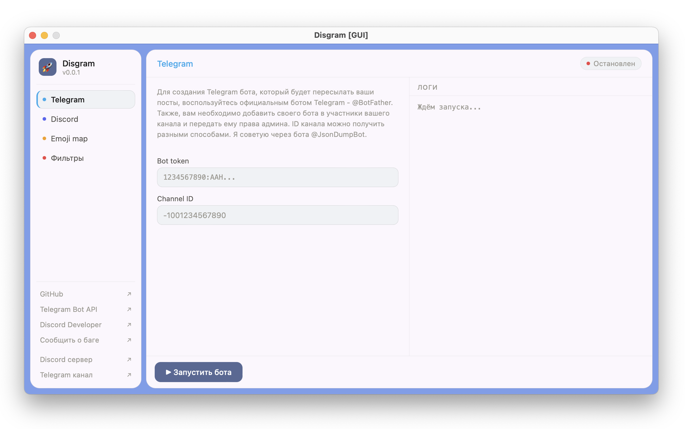

# Disgram

Discord/Telegram боты для передачи постов из Telegram канал в Discord канал на сервере с сохранением визуала и костомизированных emoji.

Каждый пост публикуется одним сообщением (текст + медиа) и под ним автоматически создаётся ветка для комментариев в Discord.



🌐 **Языки:**  
- 🇷🇺 [Русский](README.md)
- 🇬🇧 [English](ENG_README.md)

## ✨ Возможности
- 🔁 Пересылка постов из Telegram канала в Discord канал
- 😀 1:1 мапинг кастомных emoji Telegram → Discord
- 🎨 Сохранение форматирования Markdown
- 🧵 Автоматическое создание ветки комментариев под каждым постом
- 🚫 Фильтрация постов по стоп-словам

## 📦 **Требования**
- Python 3.10+
- Poetry 2.1.3+

## 🛠 **Установка**

Данная инструкция подходит для разворачивания на сервере или запуска без GUI.

Для более простой настройки локально, используйте GUI версию, скачав ее из раздела [Releases](https://github.com/kirssei/disgram/releases).

1. Клонировать репозиторий
```bash
git clone https://github.com/kirssei/disgram
cd disgram
```

2. Создать виртуальное окружение и активировать его
```bash
python3 -m venv env
. env/bin/activate
```

*Если у вас Windows, то вирутальное окружение активируется следующей командой: `env\Scripts\activate`*

3. Установить зависимости
```bash
poetry install
```

4. Создать файл `config.yaml` на основе файла `config.example.yaml` и заполнить необходимые переменные

| Переменная | Описание|
|---|---|
| TELEGRAM_TOKEN | Токен бота Telegram. Можно получить у @BotFather |
| DISCORD_TOKEN | Токен бота Discord. Можно получить в [Discord Dev](https://discord.com/developers/)|
| TELEGRAM_CHANNEL_ID | ID Telegram канал откуда надо пересылать посты. Можно получить через бота @JsonDumpBot|
| DISCORD_CHANNEL_ID | ID Discord канала куда отправлять посты из Telegram канала. Можно получить через клик правой кнопки мыши по каналу |
| USE_THREAD | Создавать треды для комментариев? |
| DISCORD_THREAD_NAME | Название ветки, которая будет создаваться к сообщению |
| USE_ROLE | Использовать пинг ролей? |
| ROLES_PING | Какие роли необходимо пинговать при отправке поста в канал Discord |
| EMOJI_MAP | Мапинг emoji с Telegram пака с emoji Discord сервера |
| STOP_WORDS | При обнаружении слова из этого списка в тексте поста Telegram, он не отправляется в Discord канал. **Слова вписываются с маленькой буквы и через запятую с пробелом**|

## 🚀 Запуск
Если используете не GUI версию:
```bash
python disgram.py
```  

Если используете GUI версию, то внутри есть описание по запуску.  


> [!WARNING]
> Созданный вами Discord бот должен находиться на вашем Discord сервере. Созданный вами Telegram бот должен быть участником канала откуда пересылаются посты (и иметь права администратора)